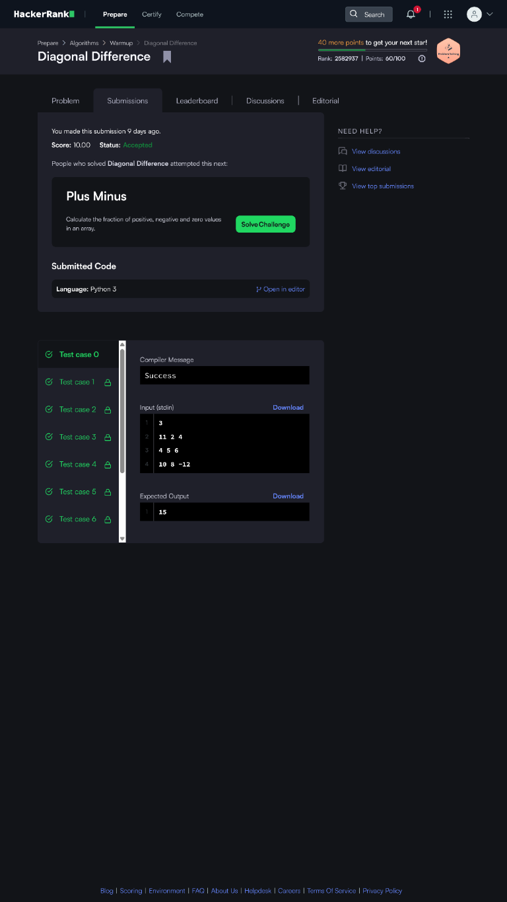
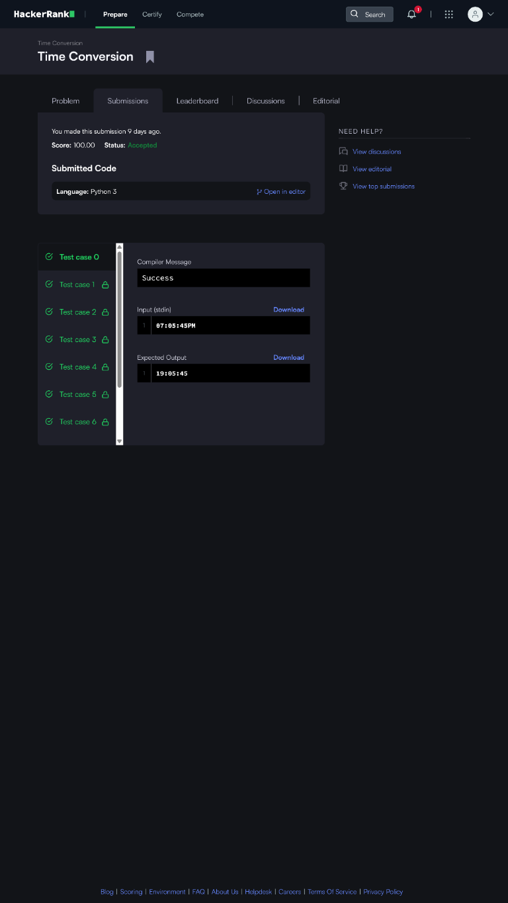
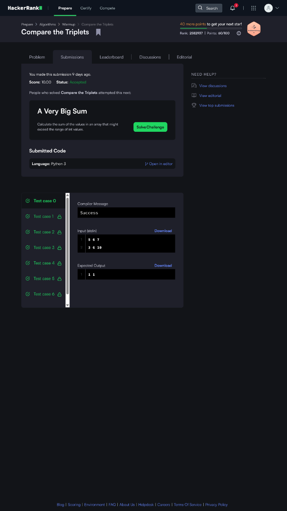
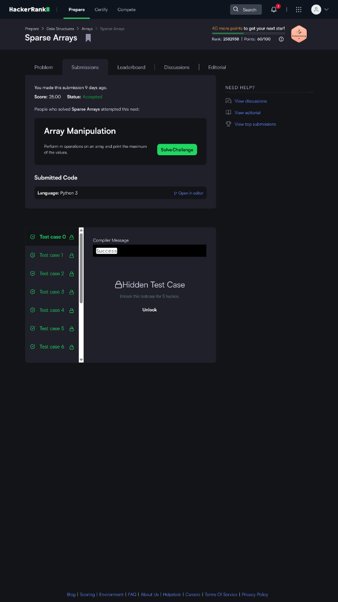
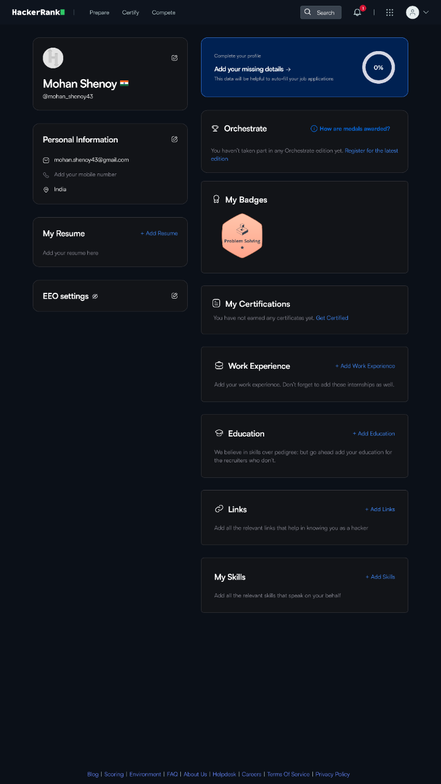

# HackerRank-3rdSem-Portfolio

Activity 8: HackerRank Algorithmic Problem-Solving & Portfolio Integration (B25CS0311, 3rd Semester B.Tech).
All solutions are in Python 3.

## HackerRank Profile
[mohan_shenoy43](https://www.hackerrank.com/profile/mohan_shenoy43)

## Problems & Complexity

| # | Problem | Category | Time | Space | Solution |
| --- | --- | --- | --- | --- | --- |
| 1 | Diagonal Difference | 2D Arrays | O(N) | O(1) | [solution.py](01-Diagonal-Difference/solution.py) |
| 2 | Dynamic Array | Data Structures | O(N + Q) | O(N + Q) | [solution.py](02-Dynamic-Array/solution.py) |
| 3 | Time Conversion | Strings & Logic | O(1) | O(1) | [solution.py](03-Time-Conversion/solution.py) |
| 4 | Compare the Triplets | Implementation | O(1) | O(1) | [solution.py](04-Compare-the-Triplets/solution.py) |
| 5 | Sparse Arrays | Hash Maps | O(N + Q) | O(N) | [solution.py](05-Sparse-Arrays/solution.py) |

## Screenshots
### Accepted submissions

| Problem | Screenshot |
| --- | --- |
| Diagonal Difference |  |
| Dynamic Array |  |
| Time Conversion |  |
| Compare the Triplets |  |
| Sparse Arrays |  |

### HackerRank profile



## Running locally
```bash
python tests.py
```
